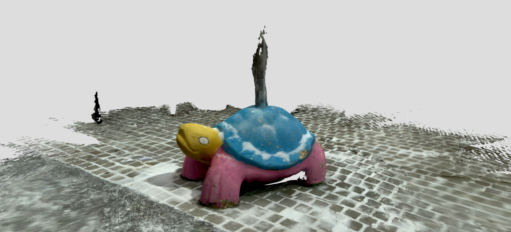
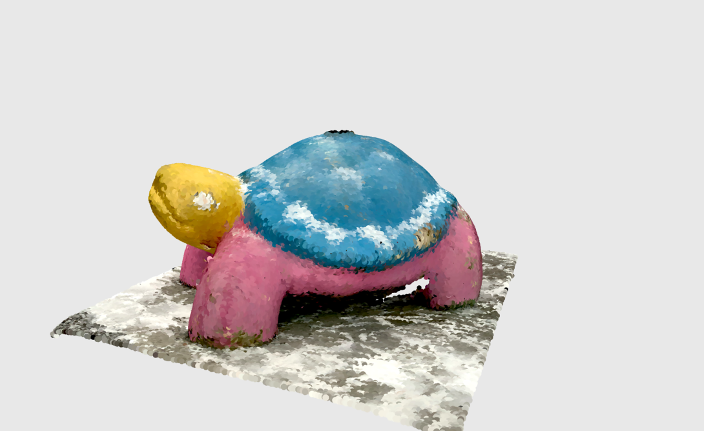

# 3D Scanner App

**3D Scanner App** is an iOS application that uses LiDAR and photogrammetry to create 3D scans.

The app was tested to create 3D models using a LiDAR device.

This example shows two different scan outputs of a turtle statue captured using the app — one in mesh format (.glb) and one as a point cloud (.ply).

_[Turtle mesh scan taken with the 3D Scanner App, exported in .glb format](https://sketchfab.com/models/e070f5500c6346c5bd921618a1be1ef0/embed)_

_[Turtle point cloud scan taken with the 3D Scanner App, exported in .ply format](https://sketchfab.com/models/0b36415c5be94e8f84e2e6e4e2408bc6/embed)_

---

## 🔑 Key Points

- 📱 iOS app that supports both LiDAR and photogrammetry
- 📤 Generates mesh (.glb) and point-cloud (.ply) files

---

## 🧰 Technologies

- **Device:** iPad Pro 2020 with LiDAR
- **Application:** 3D Scanner App for iOS

---

## 💡 Where to Use

- Document and preserve spaces like photos
- Share artistic or cultural locations, street art etc.
- Use in game environments or creative digital content

---

## 🔗 Links

- [3dscannerapp.com](https://3dscannerapp.com)
