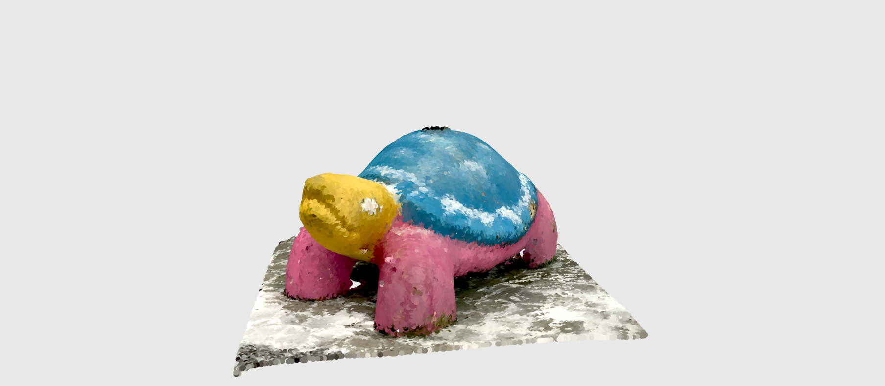

# 3D Scanner App

**3D Scanner App** is an iOS application that uses LiDAR and photogrammetry to create 3D scans.

3D Scanner App was tested to create 3D models using a LiDAR device. Mesh (.glb) and point cloud (.ply) files were generated for comparison.

---

### Embedded Scans

**LiDAR scan of a turtle in .glb mesh format**  
_Taken with 3D Scanner App for mobile (GLB format)_  
  
[View scan on Sketchfab](https://sketchfab.com/models/e070f5500c6346c5bd921618a1be1ef0/embed)

**LiDAR scan of a turtle in .ply point-cloud format**  
_Taken with 3D Scanner App for mobile (PLY point-cloud format)_  
  
[View scan on Sketchfab](https://sketchfab.com/models/0b36415c5be94e8f84e2e6e4e2408bc6/embed)

---

### Where to Use

- **Documentation & Memory:**  
  Preserve and share digital representations of spaces, similar to how photos are stored.
- **Artistic or Street Installations:**  
  Share scans of unique places like street art.
- **Game Graphics:**  
  Integrate scanned assets into game environments.

---

### Webpages

- [3dscannerapp.com](https://3dscannerapp.com)
