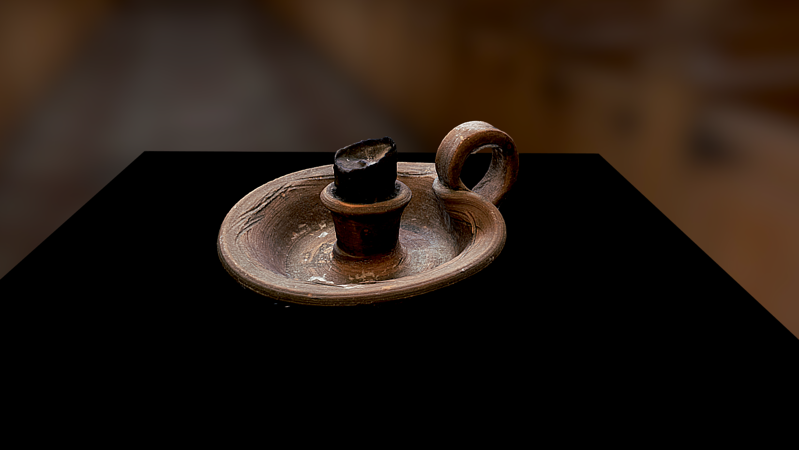

# Meshroom

**Meshroom** is an open-source photogrammetry software developed by the AliceVision Association.  
It creates 3D models by processing multiple photos taken from different angles of a real-world object.

This example shows a candle model made from 58 images processed through Meshroom and later uploaded to Sketchfab.

_[View Candle Model on Sketchfab](https://sketchfab.com/3d-models/candle-c430c6d0120c4ad18f80a912b05fd84a)_

---

## 🔑 Key Points

- 📸 Based on photogrammetry — turning images into 3D models
- 🧪 Great for experimentation and learning
- 🖥️ Open-source and fully customizable
- 🧵 Integrates with Blender for cleanup and optimization
- 🔗 Supports export to formats like GLB

---

## 🧰 Technologies

- **Device:** iPhone SE (used to take 58 images)
- **Application:** Meshroom (by AliceVision)
- **Post-processing:** Blender
- **Viewer:** Sketchfab

---

## ⚙️ Working Process

1. 58 images were taken around the object (without moving it), in natural lighting and with a black background.
2. Images were converted to JPG format and imported into Meshroom.
3. Meshroom reconstructed the 3D model using its photogrammetry pipeline.  
   [More on the pipeline](https://alicevision.org/#photogrammetry)
4. The mesh was refined in Blender and exported to GLB.
5. The final model was uploaded to Sketchfab for display.

---

## 💡 Where to Use

- 🧠 Learn and experiment with photogrammetry
- 🎨 Use in cultural and artistic projects
- 🕹️ Add custom 3D assets to games

---

## 🔗 Links

- [alicevision.org](https://alicevision.org/)
