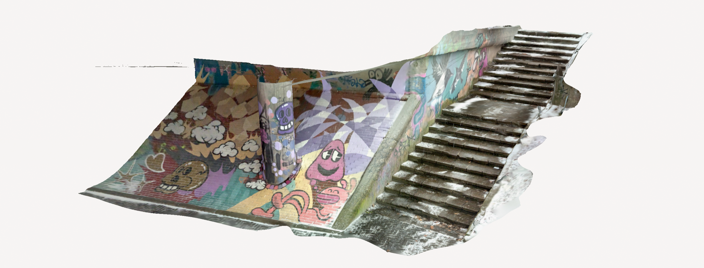

# Polycam

**Polycam** is a mobile app for scanning 3D objects and spaces using both **LiDAR** and **photogrammetry**. LiDAR-based scanning works on newer iOS devices with built-in LiDAR sensors, while photogrammetry is supported on both iOS and Android devices.

LiDAR mode captures depth data in real time, making it fast and suitable for scanning larger spaces. Photogrammetry mode captures fine surface details from photos. Polycam also supports **Gaussian splatting**, which helps generate smooth, high-quality reconstructions.

This example shows graffiti wall captured with Polycam's LiDAR mode.

_[Graffiti model created with Polycam](https://poly.cam/capture/6AE6794F-1FFC-463A-A39A-5903AD5E1081)_

---

## 🔑 Key Points

- Available for both iOS and Android
- Supports **LiDAR** and **photogrammetry** modes
- Includes **Gaussian splatting** for higher detail
- Export to formats like USDZ, GLB, OBJ
- Upload and view models on the web

---

## 🧰 Technologies

- **Device:** iPad Pro 2020 with LiDAR
- **Application:** Polycam LiDAR scanner

---

## 💡 Where to Use

- Preserve and share unique visuals — like a 3D photo
- Use in digital art, animation, or game design
- Add to AR apps for real-world visualizations

---

## 🔗 Links

- [poly.cam](https://poly.cam/)
