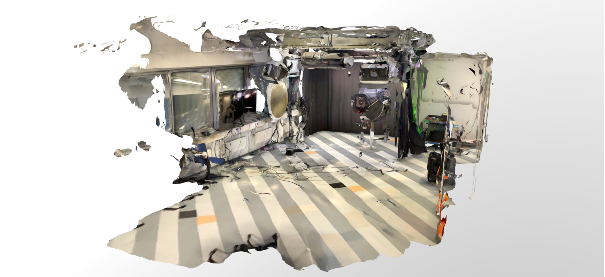

# Scaniverse

**Scaniverse** is a mobile application that uses LiDAR technology to capture detailed 3D scans of environments and objects. The app allows users to quickly generate accurate 3D models with depth information. It is designed for iOS devices with LiDAR sensors, but can also be used in photogrammetry mode on iOS or Android devices that do not have LiDAR sensors. Scaniverse also includes support for Gaussian splatting on newer devices. This feature is used to enhance 3D scan quality by applying a point-based rendering technique that creates smoother and more detailed models.

The app offers a user-friendly interface that allows users to quickly do the scans and fine-tune settings such as resolution and capture parameters. Features include real-time previewing and editing of scans, the ability to export models in common 3D file formats, and integration options for use in augmented reality (AR) and virtual reality (VR) applications.

The whole process of creating a scan is done on the mobile device, making it very easy to use. The resulting model can be viewed in the app, shared or exported for further processing.

This example demonstrates a scan of a media lab taken using a device with a LiDAR scanner.

_[Media lab scanned with Scaniverse app](https://sketchfab.com/3d-models/scaniverse-medialab-7dd270dd046c4f6799ac96126b6566fc/embed)_

---

## 🔑 Key Points

📱 Works on iOS (LiDAR) and Android (photogrammetry)
✨ Supports **Gaussian splatting** for high-quality rendering
📤 Export to multiple 3D file formats
🕶️ AR and VR integration capabilities
📦 Entire process handled on mobile — no PC needed

---

## 🧰 Technologies and Process

- **Device:** iPad Pro 2020 with LiDAR
- **Software:** Scaniverse LiDAR scanner app for iPad

---

## 💡 Where to Use

- Capture a model of a space
- Use scanned objects or environments as assets in games
- Use for creating AR experiences

---

## 🔗 Links

- [scaniverse.com](https://scaniverse.com)
