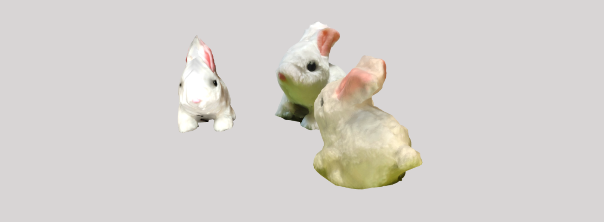

# Clara.io

**Clara.io** is a browser-based app for 3D modeling, animation, and rendering. It can be used as an online 3D editor, viewer, and sharing/embedding tool.

In this example, it was used to showcase models created using various mobile scanning apps.

[_Models displayed using Clara.io viewer_](https://clara.io/view/aec7ff3b-44f2-4636-a698-88cd62337bbb)

---

## 🔑 Key Points

- Runs in the browser, no installation needed
- Can create scenes, lighting, and animation
- Supports importing multiple model formats
- Generates viewer links

---

## 🧰 Technologies

- **Left:** Qlone mobile app for Android/iOS
- **Middle:** 3D Live Scanner for Android
- **Right:** Metascan for iOS
- Clara.io web app (free plan)

---

## 💡 Where to Use

- Share 3D scanned objects easily online

---

## 🔗 Links

- [Clara.io](https://clara.io)
- [qlone.pro](https://www.qlone.pro)
- [3D Live Scanner](https://lvonasek.github.io)
- [metascan.ai](https://metascan.ai)
