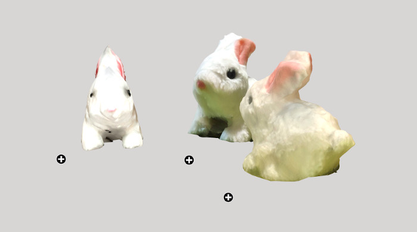

# Clara.io

[Clara.io viewer](https://clara.io/view/aec7ff3b-44f2-4636-a698-88cd62337bbb)

## Info

Clara.io is a browser-based app for 3D modelling, animation and rendering.
It can be used as ann online 3D editor as well as viewing, sharing and embedding models.
In this example it was used as editor to display models generated with other apps.

### Technologies

- **Left:** Qlone mobile app for Android/iOS (free with limits)
- **Middle:** 3D Live Scanner for Android (free with advertisements)
- **Right:** Metascan for iOS (free with limits)
- Printed out Qlone mat, size A3
- Clara.io web-app with free plan

### Working Process

- A 3D toy bunny model was made using photogrammetry with 3 different mobile applications for comparison.
- Exported .glb files. For the Qlone model, the .obj file had to be downloaded and converted to .glb in Blender because Clara.io gave an error when downloading the Qlone model directly in .glb format.
- Models imported to Clara.io editor.
- Some adjustments were made in the Clara.io editor. Their editor is very advanced, though it can be a bit confusing at first.
- The iframe link was added to the website.

### Where to Use

- Three.JS or Babylon.JS editor for creating web game content.
- Share your 3D scanned objects.

### Webpages

- [qlone.pro](https://www.qlone.pro)
- [3D Live Scanner](https://lvonasek.github.io)
- [metascan.ai](https://metascan.ai)
- [Clara.io](https://clara.io)
