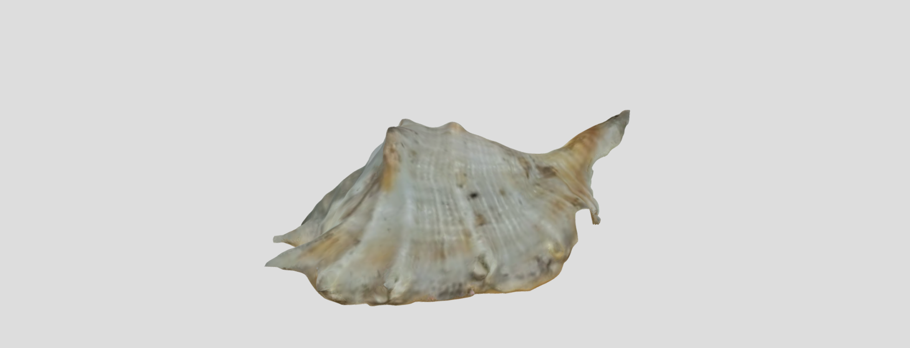

# Sketchfab

**Sketchfab** is a web-based platform for viewing and sharing 3D content.

In this example, a 3D model of a mussel was created using photogrammetry and uploaded to Sketchfab.

[_Model displayed using Sketchfab viewer_](https://sketchfab.com/models/e8aad827ecb244e28427864c57b18587/embed)

---

## 🔑 Key Points

- View and share 3D content
- Includes a simple editor
- Can add annotations in editor
- Can sell and download models
- Easy to embed on web pages

---

## 🧰 Technologies

- **Device:** Android phone
- **Application:** Qlone mobile app
- **Capture Setup:** Qlone mat (printed, A4 size)
- **Viewer:** Sketchfab web application

---

## 💡 Where to Use

- Online portfolios
- E-commerce and marketing with interactive product views
- Sell or license 3D assets

---

## 🔗 Links

- [sketchfab.com](https://sketchfab.com)
- [qlone.pro](https://www.qlone.pro)
