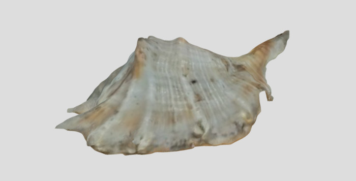

# Sketchfab

[Sketchfab viewer](https://sketchfab.com/models/e8aad827ecb244e28427864c57b18587/embed)

## Info

Sketchfab is a web-based viewer for 3D, virtual reality (VR) and augmented reality (AR) content.
The viewer is based on WebGL ad WebXR technologies that allows 3D models to be viewed in browser on desktop, mobile or VR headset.
The platform allows you to view, share, and embed 3D assets.  
In this example, it was used to display a model created with photogrammetry.

### Technologies

- **Photogrammetry:**
  - Qlone mobile app for Android/iOS (free with limits)
- **Materials:**
  - Printed out Qlone mat, size A4
- **Viewer:**
  - Sketchfab web-app (free with limits)

### Working Process

- A 3D mussel model was created using photogrammetry with the Qlone mobile app for Android.
- A .glb file was exported and uploaded to Sketchfab.

### Where to Use

- As online portfolio to showcase your 3D models or animations.
- Sell your 3D models or buy.
- E-commerce and marketing: interactive 3D views of products.

### Webpages

- [qlone.pro](https://www.qlone.pro)
- [sketchfab.com](https://sketchfab.com)
