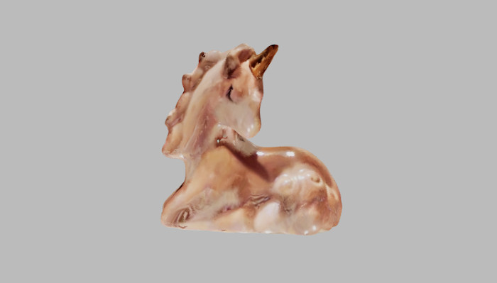

# Three.js

[three.js](https://threejs.org)

## Info

**Three.js** is a popular JavaScript library that uses WebGL to render 3D graphics in the browser. It simplifies tasks like managing scenes, lights, cameras, and animations. Three.js also supports post-processing, allowing you to apply visual effects—such as bloom, depth of field, or color adjustmenets after the scene has been render.

You can also use it with React, using libraries like **react-three-fiber**, which makes it easy to add 3D content to your React projects. Three.js supports WebXR, allowing developers to create augmented reality (AR) and virtual reality (VR) experiences on a range of devices.

In this example, we created a **3D unicorn figure** using photogrammetry, then loaded it into Three.js to illustrate how to set up a scene and render a model.

### Technologies

- **Photogrammetry:**
  - Qlone mobile app for Android/iOS (free with limits)
- **Materials:**
  - Printed out Qlone mat, size A2
- **Viewer:**
  - Three.js library (open source)

### Working Process

- A 3D unicorn figure was created with the Qlone mobile app and an Android phone.
- A .glb file was imported to Three.js.
- [Three.js basic example was followed](https://threejs.org/manual/#en/fundamentals) was followed to create a scene and render an object.

### Where to Use

### Where to Use Three.js

-Interactive product showcases to display objects in 3D
-Web 3D games
-Using WebXR features to create VR/AR experiences or games

### Webpages

- [qlone.pro](https://www.qlone.pro)
- [three.js](https://threejs.org)
