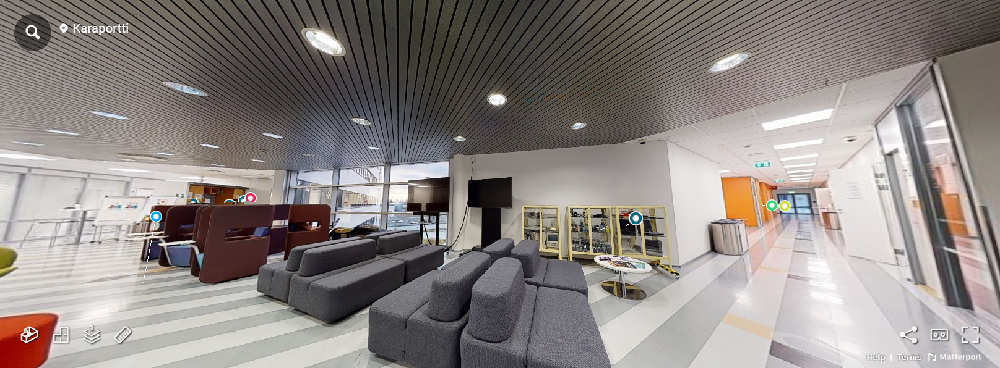

# Matterport

**Matterport** is a platform that creates immersive 3D models and virtual tours from 360° scans of real-world spaces. It uses cameras like the Matterport Pro2 to capture detailed spatial data, which is then processed in the cloud to generate a 3D model and a virtual tour of the space. In Matterport cloud, some details like annotations with information can be added. A link to the virtual tour can be embedded to a webpage. However, even with a paid subscription, downloading the 3D model of the space will cost additional fee.

Matterport also has API and SDK developer tools, which allows integration into 3rd-party applications, but they require purchasing a license.

## Working Process

1. 360° scans were taken at the Metropolia Karamalmi campus using the Matterport camera.
2. Scans were automatically uploaded to the Matterport cloud.
3. A full 3D model and virtual tour were prepared within 3–5 hours.
4. Additional mattertags were added to provide extra information.

## Where to Use

- **Real Estate:**  
  Provide potential buyers with detailed virtual tours to better understand apartments or properties.
- **Virtual Tours:**  
  Ideal for galleries, shops, schools, and workplaces.
- **Architecture/Construction:**  
  Showcase spaces and buildings, which is useful when purchasing CAD and BIM files.

## Webpages

- [Matterport](https://matterport.com)
