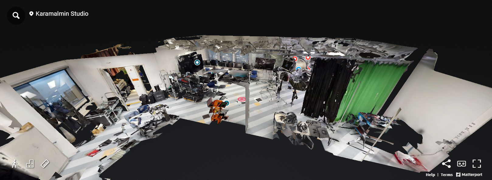

# Matterport

**Media Lab Virtual Tour**

**Media Lab 3D Model**

**Karamalmi Campus Virtual Tour**

**Matterport** is a platform that creates immersive 3D models and virtual tours from 360° scans of real-world spaces. It uses cameras like the Matterport Pro2 to capture detailed spatial data, which is then processed in the cloud to generate a 3D model and a virtual tour of the space. Within the Matterport cloud, additional details such as annotations can be added. A link to the virtual tour can be embedded into a webpage. Note that even with a paid subscription, downloading the 3D model of the space incurs an extra fee.

Matterport also offers API and SDK developer tools that allow integration into third-party applications, although these require purchasing a license.

---

## Working Process

1. 360° scans were taken at the Metropolia Karamalmi campus using the Matterport camera.
2. The scans were automatically uploaded to the Matterport cloud.
3. A full 3D model and virtual tour were prepared within 3–5 hours.
4. Additional mattertags were added to provide extra information.

---

## Where to Use

- **Real Estate:**  
  Provide potential buyers with detailed virtual tours to better understand properties.
- **Virtual Tours:**  
  Ideal for galleries, shops, schools, and workplaces.
- **Architecture/Construction:**  
  Showcase spaces and buildings; especially useful when purchasing CAD and BIM files.

---

## Webpages

- [Matterport](https://matterport.com)
