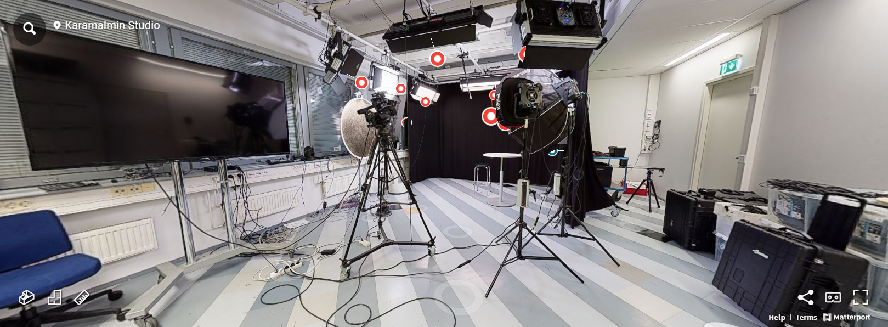

# Matterport

**Matterport** is a platform that turns real-world spaces into interactive 3D models and virtual tours using 360° scans. It works with cameras like the Matterport Pro2, which capture detailed spatial data that's processed in the cloud to generate immersive experiences.

Additional information (such as annotations) can be added using Matterport's cloud tools, and virtual tours can be embedded on websites.

Even with a paid subscription, exporting the 3D model incurs an extra fee.

Matterport also provides APIs and SDKs for integrating tours into third-party platforms, but these developer tools require a specific license.

  
[_Media Lab Virtual Tour_](https://discover.matterport.com/space/pEbNwaqkErA)

  
[_Media Lab 3D Model_](https://discover.matterport.com/space/pEbNwaqkErA)

  
[_Karamalmi Campus Virtual Tour_](https://discover.matterport.com/space/T32nCkyJRpv)

---

## 🔑 Key Points

- Generates virtual tours and 3D models
- Embeddable tours for websites
- Requires subscription, also export and developer tools require extra fees

---

## 🧰 Technologies

- **Camera:** Matterport Pro2
- **Platform:** Matterport cloud

---

## ⚙️ Working Process

1. 360° scans were taken at the Metropolia Karamalmi campus using the Matterport camera.
2. Scans uploaded to the Matterport cloud.
3. A full 3D model and virtual tour were generated within 3–5 hours.
4. Mattertags (interactive info spots) were added for additional details.

---

## 💡 Where to Use

- Real estate
- **Exhibitions & Shops:** Digital tours for galleries, stores, and schools
- **Architecture/Construction:** Useful for generating CAD/BIM data and tracking project progress

---

## 🔗 Links

- [matterport.com](https://matterport.com)
