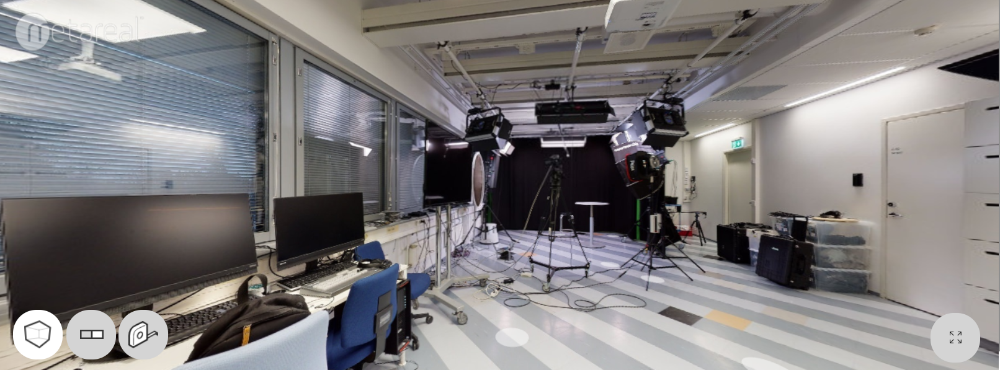

# Metareal Virtual Tour

**Metareal** is a web-based platform for creating 3D virtual tours using 360° photos. Unlike Matterport, it does not require proprietary hardware, you can use any 360° camera.
The editor, **Metareal Stage**, allows users to build virtual tours by aligning panoramas.

[_Virtual tour created with Metareal Stage_](https://tour-eu.metareal.com/apps/player?asset=f846831f-e2e2-4c90-bd4c-5f4088e9769b&position=-2.32x1.50y0.64z&rotation=2.07x-69.98y0.00z)

---

## 🔑 Key Points

- Compatible with any 360° camera
- All editing done in the browser
- Align panoramas manually
- Takes some time to learn the editor

---

## 🧰 Technologies

- **Camera:** Matterport Pro2
- **Software:** Metareal Stage web-editor

---

## ⚙️ Working Process

1. 360° images were taken at the Metropolia Karamalmi campus using a Matterport camera.
2. Images were downloaded from the Matterport cloud and uploaded to Metareal Stage.
3. A reference panorama was chosen, aligned to grid, and leveled.
4. Other panoramas were aligned to the reference.
5. A tour was created in the editor using hotspots.

---

## 💡 Where to Use

- **Education & Exhibitions:** Create guided tours for learning environments or galleries
- Real estate

---

## 🔗 Links

- [metareal.com](https://www.metareal.com/)
