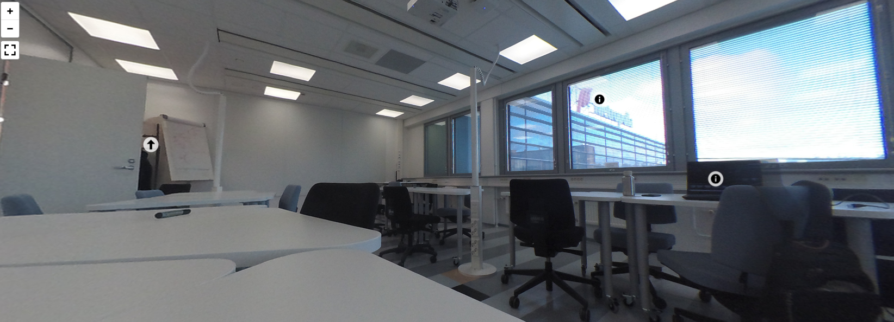

# Pannellum

**Pannellum** is a JavaScript library for displaying 360° panoramic images in the browser. It is a lightweight option for creating simple virtual tours.

_Example panorama using cube-mapped 360° images_

---

## 🔑 Key Points

- Displays 360° panoramas without heavy frameworks
- Supports cube-mapped images
- Can add interactive hotspots

---

## 🧰 Technologies

- **Camera:** Garmin Virb 360
- **Software:** Pannellum panorama viewer
- **Tools:** Sphere-to-cube image converter

---

## ⚙️ Working Process

1. 360° images were taken at Metropolia Karamalmi campus using a Garmin Virb 360 camera.
2. Images were converted into cube faces using a sphere-to-cube converter.
3. Panorama scenes were created using the Pannellum library.
4. Hotspots were added to enable basic interactivity within the tour.

---

## 💡 Where to Use

- **Virtual Tours:** Lightweight solution for galleries, exhibitions, schools, or stores
- **Web Projects:** Embed simple 360° scenes without complex 3D frameworks

---

## 🔗 Links

- [pannellum.org](https://pannellum.org)
